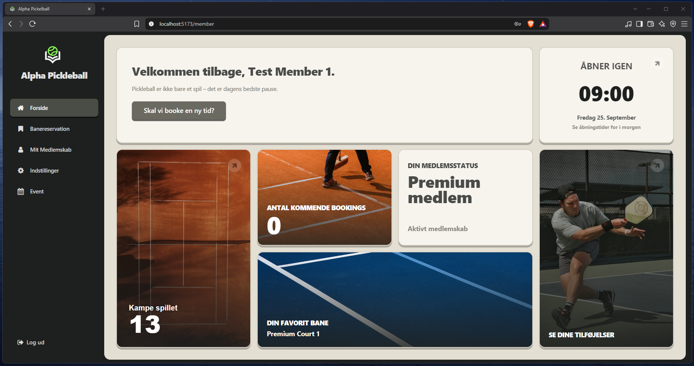
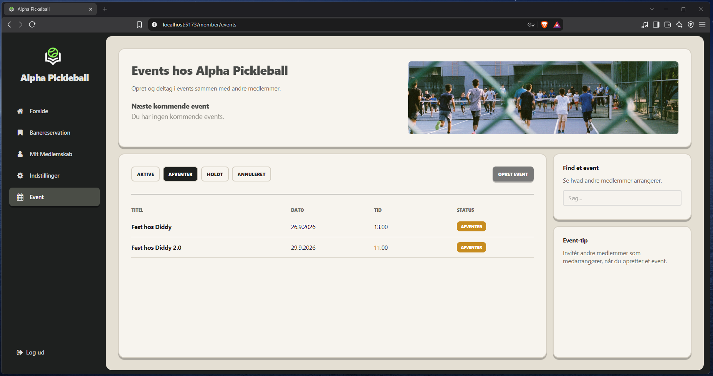

# Alpha Solution Scrum Project

Project created by Jonas for the 4th Term of AP Computer Science Denmark.

[](http://alpha.guacamoleboy.dk)

---

> [!NOTE]  
> All files in the **[main]** branch are final

---

## Visual Presentation

Member & Owner Dashboard for a Pickleball Facility




---

## Links

REST API: N/A\
Website: N/A\
Github Projects: N/A\
Docs: N/A

---

## Short presentation

Our project is a Pickelball planner tool for the Product Owner. The Product Owner in our case is the owner of the facility. The CEO.

Why?
A pickelball court is limited in staff needed in order to operate. Most staff needed is service personel.

We are going to include Staff Planning as a seperate tool for the Product Owner in order to fully comply with the task provided by Klaus during class.
This should showcase the Product Owners resources at any given time of the day and provide a clear overview along with (hopefully) warnings if the team capacity is at limit or close to it.

---

## MVP

The system should be a **resource planner** for the Pickelball Facility Owner to track his facility by moving, adding and deleting resources such as **Staff**, **Courts**, **Operating Hours** & **Assignments** to track and plan ahead of schedule.
By allowing the Owner to implement the system he should be able to see **when his resources are spent up** and need to add additional staff **to handle demand**.
As a **member** I should be able to **book a court from my selected membership in any available time during the Operating Hours** of the Facility.

---

## Folder Structure

This section is to showcase our folder structure. We are using a shared / feature architecture for out frontend application and a normal CRUD REST API Setup for our Java backend.

### Backend

```text
backend/
└── src/
    |
    └── main/
        |
        ├── resources/
        |   |
        |   ├── config.properties
        |   ├── .env
        |   ├── .env.development
        |   ├── .env.test
        |   ├── logback.xml
        |   └── http/
        |
        └── java/
            |
            └── alpha/
                |
                ├── <domain>/
                |   |
                |   ├── controller/
                |   ├── service/
                |   ├── dao/
                |   ├── entity/
                |   ├── dto/
                |   ├── mapper/
                |   └── ...
                |
                ├── config/
                ├── crud/
                ├── exception/
                ├── server/
                ├── security/
                ├── service/
                ├── route/
                ├── dao/
                ├── util/
                └── Main.java
```

### Frontend

```text
frontend/
└── src/ 
    |
    |
    ├── api/
    |   ├── endpoints/
    |   ├── client.js
    |   ├── crud.js
    |
    ├── app/
    |   ├── pages/
    |   ├── routes/
    |   ├── layout/
    |   ├── App.jsx
    |   └── main.jsx
    |
    ├── features/
    |       └── home-page/
    |               └── component-name/
    |                       ├── ComponentName.jsx
    |                       ├── ComponentName.hooks.js (If needed)
    |                       └── ComponentName.module.css
    |
    └── shared/
            ├── styles/
            |   └── globals.css
            ├── data/
            └── components/
                    └── component-name/
                            ├── ComponentName.jsx
                            ├── ComponentName.hooks.js (If needed)
                            └── ComponentName.module.css
```

---

<div align="center">
    <sub>Alpha Solution Scrum Project - 2026</sub>
</div>